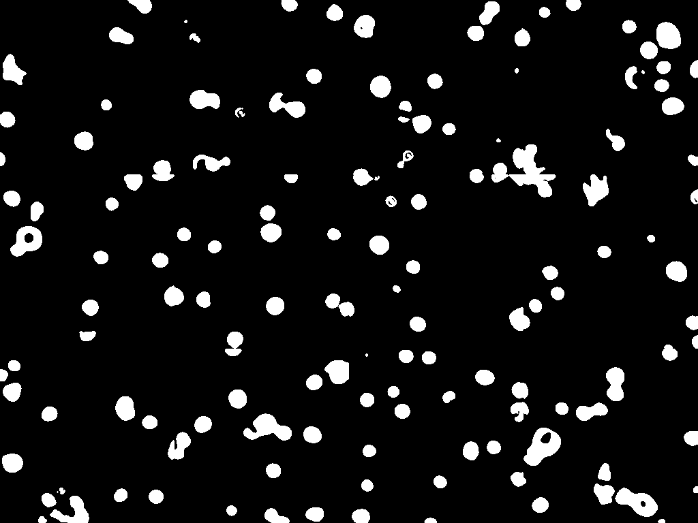

# Cell Segmentation - UNET

Keras implementation of U-net for stem cell segmentation. This trained model is used for my graduate project. 

## Datasets

The dataset (provided by Tsinghua Yangtze Delta Research Institute) consists of 38 microscopy images of stem cells at various passages (P2, P6 and P7). The sizes of these images are all 1024x768. 

## Process Data

The U-Net architecture we use for this project takes input images with sizes 256x256. In order to obtain more accurate cell segmentation results, the images in original dataset are cropped into 256x256 patches. This is also to prevent distortion of the cell images during data augmentation. During augmentation, if the images were in their original sizes, they would be resized into 256x256 hence producing a result dataset with lower qualities and distorted shapes which could not match with original dataset. 
The cropped dataset for cells with each passage number is divided so that 80\% of it becomes training data and 20\% becomes validation data. The same data split is also applied to their corresponding ground truth data, which consists of the segmentation images (masks). 

** Here, we provid the training data and validation data (along with corresponding ground truth data) in their original size (1024x768) because cropped dataset has a large file number which is not allowed when uploading to Github. **

[Training Data](trainingset_original)

[Validation Data](testset_original)

The ground truth data are obtained using ImageJ. Macro script was used to generate a batch of segmentation images at once. The original images are first converted into 8-bit grayscale images and segmented using ImageJ thresholding operation. Since the pixel value range varies significantly between images taken in different cell generations, threshold values need to be changed for these images. It was observed that thresholding method may not be enough for generate good true values of masks. For example, the core of segmented cells may be black (having pixel values of 0) after thresholding. Hence “Fill Holes” and “Watershed” operations are applied for supplement. They make the segmented cells more solid and separate the cells which are next to each other.

## Results

The table shows the segmentation result for cells in different passages. As you can see, segmentation result is much better when there is high contrast between cells and background. 

| Passage Number| Original                                           | Segmentation                                                     |
| ------------- |:--------------------------------------------------:|:----------------------------------------------------------------:|
| P2            |||
| P6            |||
| P7            |||

